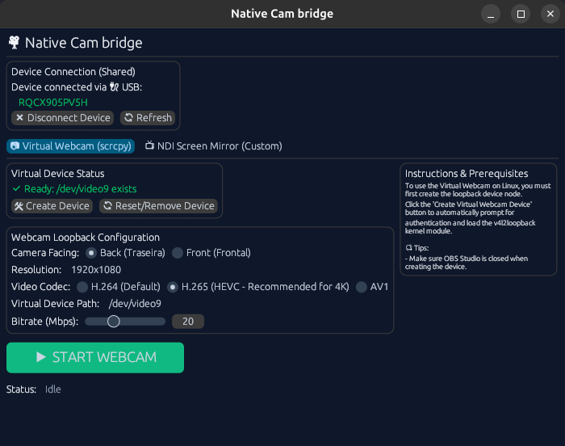
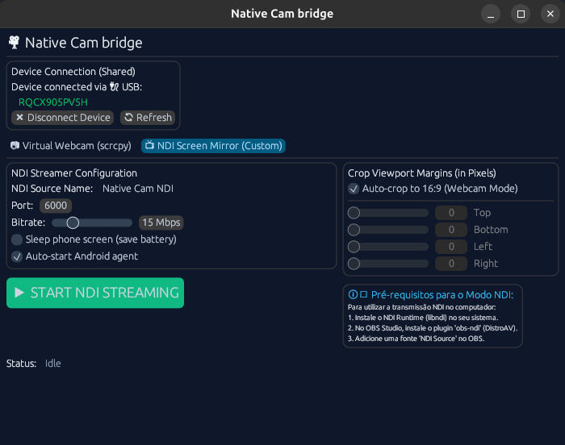

# 🎥 Native Webcam bridge

Uma ferramenta gráfica de altíssima performance e baixa latência escrita em Rust para transformar o seu dispositivo Android (como o Samsung Galaxy S23) em uma webcam profissional com delay zero para o **OBS Studio**, **Zoom**, **Google Meet** e outros.

---

### 🌐 Idiomas / Languages
* 🇧🇷 **Português (Brasil)**
* 🇬🇧 **[English version of this document here](README_EN.md)** (Para criar depois)

---

<p align="center">
  
  
</p>

---

## 🚀 Como Baixar

Você **não precisa compilar nada** para usar! O robô do GitHub Actions compila os executáveis prontos para uso a cada atualização.

Vá na aba **[Releases](https://github.com/Tiago-Silva/native-webcam-bridge/releases)** à direita da página e baixe a última versão:

* 🪟 **Windows**: Baixe o arquivo `Native_Cam_bridge_win64.zip`.
  1. Extraia o conteúdo do arquivo `.zip` em uma pasta de sua preferência.
  2. Dê dois cliques em `native-cam-client.exe` para abrir a interface gráfica.
  *(A DLL do NDI e todos os arquivos do celular já estão inclusos para funcionar sem nenhuma instalação adicional!)*

* 🐧 **Linux**: Baixe o arquivo `Native_Cam_bridge.AppImage`.
  1. Dê permissão de execução ao arquivo:
     ```bash
     chmod +x Native_Cam_bridge.AppImage
     ```
  2. Dê dois cliques no arquivo `AppImage` para abrir.

---

## 🛠️ Instruções de Uso (Passo a Passo)

Para utilizar a ferramenta com sucesso, siga este passo a passo:

### Passo 1: Habilitar o Modo Desenvolvedor e a Depuração no Celular
Antes de tudo, configure seu celular seguindo as etapas da seção [Configuração do Celular (Android)](#-configuração-do-celular-android) abaixo. Você precisará ativar:
* **Depuração USB** (para conexão via cabo USB).
* **Depuração sem fio** (caso prefira conectar sem fios via Wi-Fi).

---

### Passo 2: Conectar o Celular ao Computador
Escolha uma das duas formas de conexão abaixo:

#### Opção A: Conexão via Cabo USB (Recomendado para menor latência)
1. Conecte o celular ao computador usando um cabo USB de boa qualidade.
2. **Autorize a Depuração no Celular (Crucial!)**: 
   * Ao conectar o cabo, fique atento à tela do celular. Um aviso pop-up perguntando **"Permitir depuração USB?"** será exibido.
   * Marque a opção **"Sempre permitir a partir deste computador"** e toque em **Permitir**. 
   * *Se você não autorizar, o computador não conseguirá se comunicar com o celular.*

#### Opção B: Conexão via Wi-Fi (Sem Fios)
1. Certifique-se de que o computador e o celular estejam conectados na **mesma rede Wi-Fi**.
2. No celular, vá em **Configurações > Opções do desenvolvedor > Depuração sem fio** e ative a chave.
3. Toque no texto **"Depuração sem fio"** para entrar na tela de detalhes. Lá você verá o **Endereço IP e porta** (ex: `192.168.1.50:39845`).
4. **Autorize a Depuração**: Se for a primeira vez, pode aparecer um aviso na tela do celular perguntando se deseja permitir a depuração sem fio nesta rede. Toque em **Permitir**.
5. Abra o aplicativo **Native Webcam Bridge** no computador e insira esse **Endereço IP** e a **Porta** no campo de conexão Wi-Fi correspondente.

---

### Passo 3: Escolher o Modo no Aplicativo e Iniciar
Com o celular conectado e devidamente autorizado, execute o **Native Webcam Bridge** no computador e escolha um dos modos de operação:

* **Modo Webcam Virtual**: 
  - Se estiver no Linux, clique em **Create Device** e digite sua senha de administrador para iniciar o módulo virtual do kernel (`v4l2loopback`). No Windows, este passo não é necessário.
  - Selecione a resolução e o codec desejados.
  - Clique em **Start Webcam** para iniciar a transmissão.
  - No OBS Studio, Zoom ou Google Meet, adicione um dispositivo de captura de vídeo e selecione a câmera virtual criada.
* **Modo Espelhamento NDI**:
  - Selecione a resolução e o codec desejados.
  - Clique em **Start NDI** para começar a espelhar e publicar o vídeo na rede local.
  - No OBS Studio (com o plugin OBS-NDI instalado) ou outro software compatível, adicione uma fonte NDI e selecione o feed vindo do aplicativo.

---

## ✨ Principais Recursos

* **Modo de Operação Duplo**:
  1. **Modo Webcam Virtual (scrcpy + v4l2loopback)**: Transmite o feed da câmera física diretamente para um dispositivo virtual do sistema `/dev/video*`. Latência zero real, formato nativo 16:9 limpo (sem barras pretas nas laterais) e consumo mínimo de CPU.
  2. **Modo NDI Screen Mirror (Custom)**: Roda um agente nativo leve no Android para capturar a tela do celular, corta barras de status e bordas pretas via pixels, e publica o vídeo limpo na rede local como uma fonte NDI profissional.
* **Seleção Inteligente do Codec H.265 (HEVC)**: Detecta de forma inteligente se a placa de vídeo do seu computador suporta decodificação HEVC no FFmpeg ao iniciar. Caso suporte, define H.265 como padrão para transmissões ultraleves em alta definição (até 4K). Se não, reverte automaticamente para o H.264.
* **Automação do Kernel (Linux)**: Dispara um diálogo de autenticação gráfica para carregar o módulo de kernel `v4l2loopback` em tempo real.
* **Prevenção de Travamentos (Reset de Driver)**: Interface com botão **Reset/Remove Device** integrado para limpar os buffers do dispositivo e destravar a câmera instantaneamente em caso de troca de resolução ou tela verde.
* **Suporte ADB USB e Wi-Fi**: Detecta conexões automaticamente e força o encapsulamento de portas de envio (`--force-adb-forward`) para contornar falhas de rede em modo sem fio.

---

## 📐 Diagrama de Arquitetura

```mermaid
graph TD
    subgraph S23 / Dispositivo Android
        A[Sensor da Câmera] -->|agente scrcpy| B[Encoder de Hardware MediaCodec]
        C[Visualização de Sistema] -->|Servidor Native Cam| B
    end

    subgraph Computador Host (Cliente Native Webcam bridge)
        B -->|Túnel ADB USB / Wi-Fi| D[Interface Rust Client]
        D -->|Demux / Decode FFmpeg| E{Modo Selecionado}
        E -->|Modo Webcam| F[v4l2loopback /dev/video9]
        E -->|Modo NDI| G[NDI SDK Sender]
    end

    F -->|Dispositivo de Vídeo V4L2| H[OBS Studio / Zoom / Meet]
    G -->|Fonte NDI de Rede| H
```

---

## 📱 Configuração do Celular (Android)

1. Vá em **Configurações > Sobre o telefone > Informações do software** e clique em **Número de compilação** 7 vezes para ativar o modo desenvolvedor.
2. Volte ao menu principal e entre em **Opções do desenvolvedor**.
3. Ative a caixinha **Depuração USB**.
4. *(Opcional)* Se quiser usar sem fios, ative também a **Depuração sem fio** (Wireless Debugging) e conecte o celular na mesma rede Wi-Fi do seu computador.

---

## 🔍 Resolução de Problemas (Troubleshooting)

### 1. Sensor de Câmera Ocupado (Samsung Câmera Eviction)
No Android, apenas um aplicativo pode usar a câmera física por vez.
* **Sintoma**: Mensagem de erro `CameraAccessException`.
* **Solução**: Feche o aplicativo nativo de Câmera da Samsung no celular. O cliente Rust abre o sensor de hardware em segundo plano, logo nenhum aplicativo de câmera precisa estar aberto ou ativo na tela do aparelho.

### 2. Vídeo com Atraso (Delay) no OBS Studio
* **Sintoma**: O vídeo acumula delay depois de algum tempo de transmissão.
* **Solução**: No OBS Studio, dê dois cliques na fonte de "Dispositivo de Captura de Vídeo (V4L2)" correspondente à câmera e mude a opção **Buffering** (Bufferização) para **Disable** (Desativar). Isso força o OBS a renderizar cada frame imediatamente em tempo real.

### 3. Tela Verde no OBS ao Mudar a Resolução
* **Sintoma**: Ao alternar resoluções (ex: de 1080p para 4K), a imagem fica verde.
* **Solução**: O dispositivo virtual fica preso no buffer de memória anterior.
  1. Clique em **Stop Webcam** na interface.
  2. Clique em **Reset/Remove Device** no app.
  3. Mude a resolução no seletor e clique em **Create Device**.
  4. Inicie o fluxo com **Start Webcam**.

---

## 📄 Licença

Este projeto é de código aberto e está licenciado sob a licença MIT.
